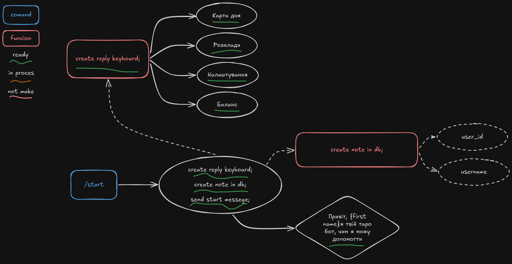

# TgTarrotBot-2.0


## Структура проєкту

```
TgTarrotBot-2.0/
├── venv/   
├── readme_photo/           
├── .env               
├── .gitignore
├── requirements.txt
├── handlers.py
├── keyboards.py
├── database.py
└── main.py            
```
#діаграма проєкту



## Встановлення

1. Клонуй репозиторій і перейди в папку проєкту:

```bash
git clone <https://github.com/K4VOOM/TgTarrotBot-2.0.git>
cd TgTarrotBot-2.0
```

2. Створи та активуй віртуальне середовище:

```bash
python -m venv venv

# Linux / Mac
source venv/bin/activate

# Windows
venv\Scripts\activate
```

3. Встанови залежності:

```bash
pip install -r requirements.txt
```

4. Створи файл `.env` у корені проєкту та додай токен бота:

```
BOT_TOKEN=твій_токен_від_BotFather
```

## Запуск

```bash
python main.py
```

## Залежності

- `aiogram` — асинхронний фреймворк для Telegram Bot API
- `python-dotenv` — завантаження змінних оточення з `.env`
